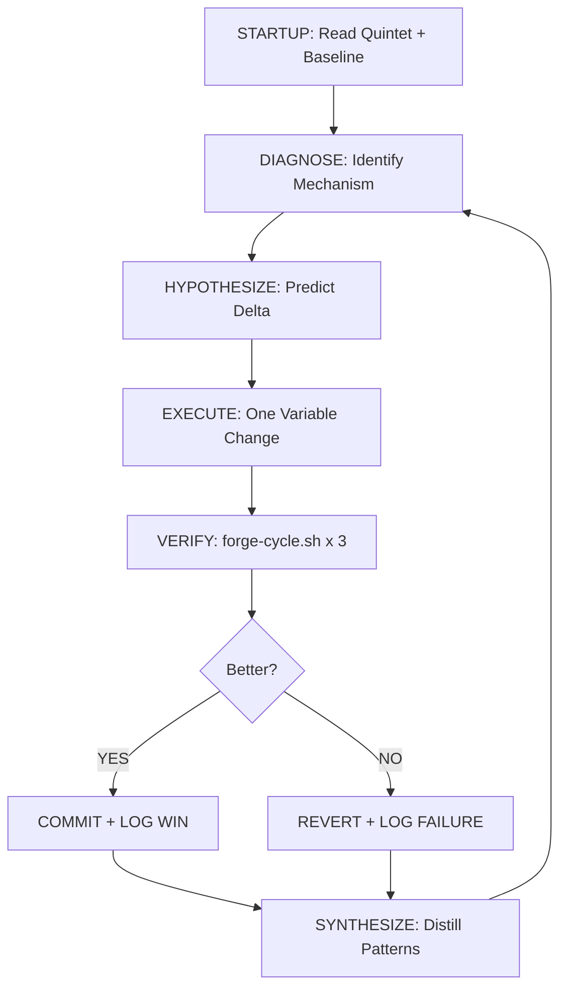

<div align="center">

# THE FORGE

**The Universal AI Research Engineer Workflow Kit — for every codebase that deserves better.**

*Diagnose · Hypothesize · Execute · Verify · Synthesize*

[](docs/CHANGELOG.md)
[](LICENSE)
[](#available-stacks)
[](#agent-agnostic)

[Getting Started](#getting-started) • [How it Works](#the-methodology) • [Documentation](docs/) • [Changelog](docs/CHANGELOG.md)

</div>

---

## What is THE FORGE?

AI coding assistants are powerful but undisciplined. Left to their own devices, they often guess and check — making unmeasured changes that fix one bug while silently introducing technical debt or performance regressions.

**THE FORGE is a portable methodology kit** that turns any AI coding assistant (Claude, Gemini, Cursor, Codex, Copilot, etc.) into a disciplined **Research Engineer**. By dropping a set of rules and measurement tools into your repository, you force the AI to:

1. **Baseline** the current state before making any changes.
2. **Hypothesize** a specific causal mechanism for improvement.
3. **Execute** exactly one change at a time.
4. **Verify** the result using a multi-dimensional scorecard.
5. **Synthesize** the findings into a shared, cross-project memory.

It is not a product or a framework. It is a **process engine** that makes your AI sessions repeatable, documented, and measurably successful.

---

## The Methodology

THE FORGE operates on a recursive, self-correcting R&D pipeline:



### The Quintet — Five Files for Absolute Discipline

| File | Role |
| :--- | :--- |
| `CLAUDE.md` | **Operating Rules:** The agent's core instructions and anti-gaming rules. |
| `RESEARCH.md` | **Active Hypothesis:** The specific experiment currently being run. |
| `EVAL_SPEC.md` | **The Scorecard:** Weights for Performance, Quality, Tests, and Debt. |
| `FORGE_SYSTEM.md` | **Architecture Map:** Module layout, contracts, and invariants for Auditor reviews. |
| `PROJECT_LOG.md` | **The Memory:** A permanent record of every success and failure. |

`EVAL.sh` is the sixth artifact — the executable harness that produces the scorecard. It is the judge.

### The Loop Driver (v4)

In v4, `forge-cycle.sh` automates all mechanical steps. One command runs the full cycle:

```bash
bash ./forge-cycle.sh --baseline-only       # measure current state
# implement your hypothesis
bash ./forge-cycle.sh --skip-baseline 6.50  # evaluate the change
```

The script handles: EVAL.sh × 3 median, variance warnings, anti-gaming anomaly detection, COMMIT / REVERT / HOLD decision, PROJECT_LOG.md write, and Obsidian sync.

---

## Getting Started

### 1. Adopt Forge into your project

**One-liner (from inside your project directory):**

```bash
bash <(curl -fsSL https://raw.githubusercontent.com/yash-dev007/THE-FORGE/main/install.sh)
```

Downloads THE FORGE to `~/.forge`, asks 5 setup questions, and runs your first `EVAL.sh` — all in under 5 minutes. The kit lives at `~/.forge` so future projects reuse it without re-downloading.

**With options:**

```bash
# Specific stack + platforms only
bash <(curl -fsSL https://raw.githubusercontent.com/yash-dev007/THE-FORGE/main/install.sh) -- --stack python --platforms claude,gemini

# Skip interactive prompts
bash <(curl -fsSL https://raw.githubusercontent.com/yash-dev007/THE-FORGE/main/install.sh) -- --no-interactive
```

**Or run the adopt script directly (if you cloned the kit):**

```bash
# Unix / macOS / Git Bash
./scripts/forge-adopt.sh --target /path/to/your-project --interactive

# Windows (PowerShell)
.\scripts\forge-adopt.ps1 -TargetRepo 'C:\path\to\your-project' -Interactive
```

**Select platforms (optional — default copies all):**

```bash
./scripts/forge-adopt.sh --target /path/to/your-project --platforms claude,gemini
```

### 2. Fill identity and architecture

Edit `FORGE_IDENTITY.md`: set `ForgeProjectSlug`, `TechStack`, and `ObsidianVaultRoot`.

Edit `FORGE_SYSTEM.md`: fill all six sections. A blank `FORGE_SYSTEM.md` produces poor Auditor reviews.

### 3. Establish baseline

```bash
bash ./forge-cycle.sh --baseline-only
```

Record the median `SCORE` in `RESEARCH.md`. You are ready to begin Cycle 1.

### 4. Fill RESEARCH.md

Set the active hypothesis (all 8 required fields). The agent outputs `[FORGE] BLOCKED` and stops if any field is missing or placeholder-only.

Required fields: `Hypothesis` · `Hypothesis Type` · `Confidence` · `Target File` · `Target Scope` · `Baseline Score` · `Goal Score` · `Exploration Budget`

---

## Available Stacks

THE FORGE ships with ready-to-use EVAL harnesses:

| Stack | Test | Quality | Debt | Performance |
|-------|------|---------|------|-------------|
| **Python** | pytest | ruff | radon CC | pytest-benchmark |
| **Node.js** | npm test | eslint | eslint complexity | vitest bench |
| **Go** | go test | golangci-lint | gocyclo | go test -bench |
| **Rust** | cargo test | clippy | cargo-geiger | cargo bench (Criterion) |
| **Minimal** | noop | noop | noop | noop |

Each stack ships with a starter benchmark file (`benchmark.py`, `benchmark.js`, `benches/forge_bench.rs`) to wire real PERF_SCORE from day one.

---

## Agent Agnostic

THE FORGE works with any AI agent that can read Markdown and run shell commands. Bridge files are provided for five platforms:

| Platform | Bridge file | Invocation |
|----------|-------------|------------|
| Claude Code | `.claude/CLAUDE.md` + `/forge-cycle` skill | Automatic on session start |
| Gemini CLI | `GEMINI.md` | Automatic on session start |
| Cursor | `.cursor/rules/forge.mdc` | Automatic as workspace rule |
| Codex | `program.md` | Automatic on session start |
| GitHub Copilot | `.github/copilot-instructions.md` | Automatic as workspace context |

See [docs/PLATFORMS.md](docs/PLATFORMS.md) for per-platform setup details.

---

## Obsidian Integration

THE FORGE uses Obsidian as its cross-project memory layer. After each cycle, `forge-obsidian-sync.sh` automatically:

- Appends a row to `Forge/Projects/<slug>/01-Score-History.md`
- Updates `Forge/Projects/<slug>/00-Project-Index.md` (win rate, last score, cycle count)
- Detects pattern promotion candidates (same mechanism committed 2+ times)

The kit ships with **15 pre-seeded patterns** across Python, Node, Go, and Universal categories — so the pattern library is not empty on day one.

See [docs/OBSIDIAN_SETUP.md](docs/OBSIDIAN_SETUP.md) for vault setup.

---

## Score Visualization

```bash
python forge-chart.py
```

Reads `PROJECT_LOG.md` and outputs `forge-chart.html` — a line chart of composite score over cycles plus a table of the last 10 cycles with COMMIT / REVERT / HOLD badges. Zero dependencies (stdlib only); uses plotly if installed.

---

## Design Principles

- **One change, one variable.** Causality cannot be understood if you change five things at once.
- **Failure is data.** A REVERT is not a setback; it is negative knowledge that prevents future mistakes.
- **Memory compounds.** The real value of THE FORGE is the pattern library you build in Obsidian that informs every future project.
- **The loop runs itself.** In v4, `forge-cycle.sh` handles all measurement, logging, and sync. The AI focuses on hypotheses and code.

---

## Documentation

| Doc | Purpose |
|-----|---------|
| [docs/ADOPT.md](docs/ADOPT.md) | Step-by-step adoption playbook |
| [docs/PLATFORMS.md](docs/PLATFORMS.md) | Per-platform setup and `--platforms` flag |
| [docs/LOOP_DRIVER.md](docs/LOOP_DRIVER.md) | forge-cycle.sh modes, anti-gaming, exit codes |
| [docs/EVAL_BENCHMARKS.md](docs/EVAL_BENCHMARKS.md) | Wiring real PERF_SCORE benchmarks per stack |
| [docs/OBSIDIAN_SETUP.md](docs/OBSIDIAN_SETUP.md) | Vault setup, co-location, pattern promotion |
| [docs/OPS_PER_REPO.md](docs/OPS_PER_REPO.md) | Auditor, velocity, and stagnation cadences |
| [docs/CHANGELOG.md](docs/CHANGELOG.md) | Kit revision history |
| [docs/spec/CLAUDE_v4.md](docs/spec/CLAUDE_v4.md) | Full v4 methodology spec |

---

<div align="center">

*Built to compound. Designed to self-correct.*

**[Browse Documentation](docs/) • [View Changelog](docs/CHANGELOG.md)**

</div>
