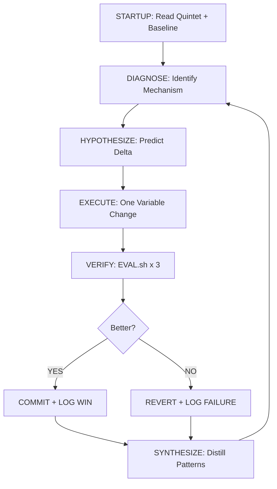

<div align="center">

# ⚒ THE FORGE

**The Universal AI Research Engineer Workflow Kit — for every codebase that deserves better.**

*Diagnose · Hypothesize · Execute · Verify · Synthesize*

[](docs/CHANGELOG.md)
[](LICENSE)
[](#-available-stacks)
[](#-agent-agnostic)

[Installation](#-getting-started) • [How it Works](#-the-methodology) • [Documentation](docs/) • [Contributing](CONTRIBUTING.md)

</div>

---

## 🚀 What is THE FORGE?

AI coding assistants are powerful but undisciplined. Left to their own devices, they often "guess and check," making unmeasured changes that fix one bug while silently introducing technical debt or performance regressions.

**THE FORGE is a portable methodology kit** that turns any AI coding assistant (Gemini, Claude, Cursor, Codex, etc.) into a disciplined **Research Engineer**. By dropping a set of rules and measurement tools into your repository, you force the AI to:

1.  **Baseline** the current state before making any changes.
2.  **Hypothesize** a specific causal mechanism for improvement.
3.  **Execute** exactly one change at a time.
4.  **Verify** the result using a multi-dimensional scorecard.
5.  **Synthesize** the findings into a shared, cross-project memory.

It is not a product or a framework. It is a **process engine** that makes your AI sessions repeatable, documented, and measurably successful.

---

## 🧠 The Methodology

THE FORGE operates on a recursive, self-correcting R&D pipeline:



### The Quintet — Five Files for Absolute Discipline

| File | Role |
| :--- | :--- |
| `CLAUDE.md` | **Universal Operating Rules:** The agent's core instructions and anti-gaming rules. |
| `RESEARCH.md` | **Active Hypothesis:** The specific experiment currently being run. |
| `EVAL_SPEC.md` | **The Scorecard:** Weights for Performance, Quality, Tests, and Debt. |
| `EVAL.sh` | **The Judge:** An executable harness that measures the code. |
| `PROJECT_LOG.md`| **The Memory:** A permanent record of every success and failure. |

---

## 🛠 Getting Started

### 1. Adopt Forge into your project

**Windows (PowerShell):**
```powershell
powershell -ExecutionPolicy Bypass -File .\scripts\forge-adopt.ps1 -TargetRepo 'C:\path\to\your-project' -Stack node
```

**Unix / macOS / Git Bash:**
```bash
./scripts/forge-adopt.sh --target /path/to/your-project --stack python
```

### 2. Configure Identity

Edit `FORGE_IDENTITY.md` in your project root to set your project slug and Obsidian vault path (for cross-project pattern memory).

### 3. Establish Baseline

Run the judge three times to get a stable starting point:
```bash
bash ./EVAL.sh
```
Record the median score in `RESEARCH.md`. You are now ready to begin Cycle 1.

---

## 📦 Available Stacks

THE FORGE ships with ready-to-use EVAL harnesses for:

*   🐍 **Python:** pytest + ruff + radon cyclomatic complexity.
*   🟢 **Node.js:** npm test + eslint + eslint complexity.
*   🐹 **Go:** go test + golangci-lint + gocyclo.
*   📁 **Minimal:** A barebones harness for custom integration.

---

## 🤖 Agent Agnostic

THE FORGE is designed to work with any AI agent that can read Markdown rules and execute shell commands. We provide explicit bridge files for:

*   **Gemini CLI:** via `GEMINI.md`
*   **Claude Code:** via `.claude/CLAUDE.md`
*   **Cursor:** via `.cursor/rules/forge-v3.mdc`
*   **And more:** Any agent that finds the root `CLAUDE.md` (the universal rules file).

---

## 📈 Design Principles

*   **One change, one variable.** causality cannot be understood if you change five things at once.
*   **Failure is data.** A REVERT is not a setback; it is negative knowledge that prevents future mistakes.
*   **Memory compounds.** The real value of THE FORGE is the pattern library you build in Obsidian that informs every future project.

---

<div align="center">

*Built to compound. Designed to self-correct.*

**[Browse Documentation](docs/) • [View Changelog](docs/CHANGELOG.md)**

</div>
